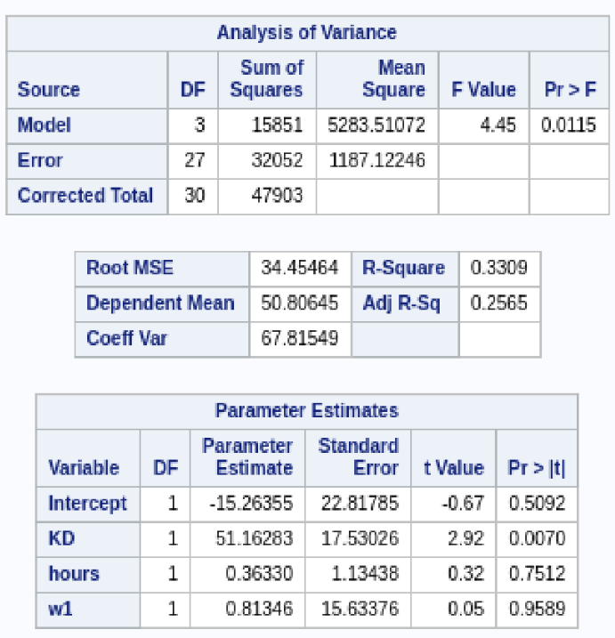

# COD_Project_SAS
 ## Introduction
Does employment status have a major effect on gaming performance? Let's find out.
## Data
#### Collection 
Warzone, a Call of Duty game, was at peak popularity when I conducted this experiment. To get data I posted in COD subreddits, sent message to users who posted regularly in the subreddit, did the same in Call of Duty discords, and loaded up the game and asked the people I was randomly paired with.  

#### Work status
Yes = full-time employment  
No = Non-full-time employment  
</img>  
#### Wins
</img>  
#### Hours  
</img>  
#### Kill-Death Ratio
</img>  

## Analysis
#### ANOVA
</img>  
Using <b>Wins</b> as the dependent variable, looking at the p-values we can see that there is sufficient evident to suggest that only the variable <b>KD</b> explains the variance of <b>Wins</b>.  
#### Regression Model
</img>  
The equation used is <b>Wins</b> = -20 + <b>KD</b>*50

## Conclusion
Given my sample, it can be concluded that eployment status has a significant effect on wins in the game.  
For a more indepth analysis including limitations, other methods, created performance criteria analysis, regression analysis with <b>hours</b> as the dependent variable and more visit the <a href = CODProjectWriteUp.pdf>project write up.</a>  

Thank you for viewing.
